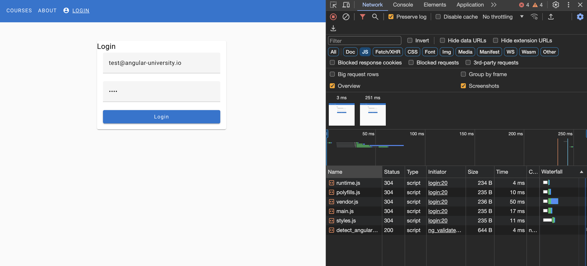
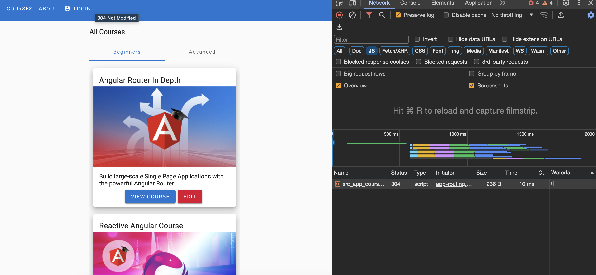

# Angular Route - Ep2

## Lazy Loading Module

作者這邊建議從專案一開始就加入 lazy loading 機制

以免專案越來越大包，會導致速度越來越慢

這邊已切分好 courses module 在 course.module.ts 內

```ts
@NgModule({
  imports: [
    // course routing module
    CoursesRoutingModule,
  ],
  providers: [
    // 只在 course.module 啟用時才使用
    CoursesService
  ]
})
```

所以在 CoursesService Injectable 會使用

```ts
@Injectable()

// 而非代表在 root 引入（這樣切分 module 就失去意義
@Injectable({
  providedIn: "root"
})
```

當 CoursesModule 已切分完畢後需要在 AppRoutingModule 去 import 它

```ts
const routes: Routes = [
  {
    path: "courses",
    // 此為非同步載入 module 預期回傳 promise
    loadChildren: () => import("./courses/courses.module").then((m) => m.CoursesModule)
  },
  {
    path: "login",
    component: LoginComponent,
  },
  {
    path: "about",
    component: AboutComponent,
  }
];
```

## ChildRouting Module

接下來到 CoursesModule 裡面的 CoursesRoutingModule 建立 route path

這邊的 path 已經包含 AppRoutingModule 的 path，所以在子路由內無需在加 courses

在 NgModule 需要 imports RouterModule

子路由後面一律接 forChild 只有在根模組（AppRoutingModule）才能使用 forRoot

```ts
const routes: Routes = [
    {
        // https://localhost:4200/courses 顯示 HomeComponent
        path: "",
        component: HomeComponent
    }
];


@NgModule({
  imports: [
      RouterModule.forChild(routes)
  ]
})
```

在 app.component.html 加入 courses routerLink

7行

```html
<a class="menu-item" mat-button routerLink="courses" routerLinkActive="menu-item-active">
  <span>Courses</span>
</a>
```

此時在 login 頁面重新整理後再點擊 navbar courses 就會有 lazy loading 效果

可以在 chrome 使用 F12 點擊到 network 選擇 JS

一開始在 login path 會預先載入 Angular 本身 bundle.js 



接下來清空 network 資料後

當 navbar 點擊到 courses 時可以發現又載入另外一個 js

此時代表 lazy loading module 成功了


