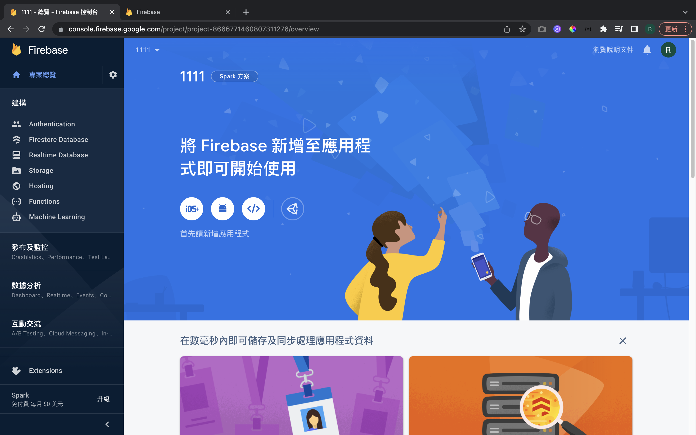
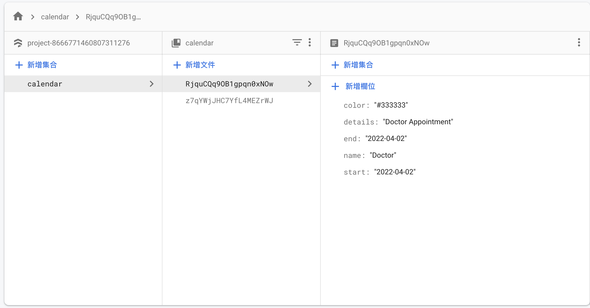

# 萬年曆 Calendar Part1

[教學影片](https://www.youtube.com/watch?v=2NOsjTT1b_k)

[firestore document](https://firebase.google.com/docs/reference/node/firebase.firestore?authuser=0) 裡面包含了所有 firebase db 的方法

[firestore collection](https://firebase.google.com/docs/reference/node/firebase.firestore.CollectionReference?authuser=0) collection 資料操作的屬性與方法

使用的架構為 Vue + Vuetify + Firebase storage

版本別如下：
| 名稱 | 版本 |
| ---- | ---- |
| Vue | 2.6.11 |
| Vuetify | 2.6.0 |
| Firebase | 9.6.10 |
| firestore | 1.1.6 |

## 創建一個 firebase app

位址：[firebase]

首先先登入 google 帳號，點擊右上角 'go to console'

Ｑ：

新增一個專案名稱 > 會詢問是否需要使用 Google Analytics (之前有聽說現在 90% 的網站都有使用，本次範例無使用) > 建立專案

建立完專案後可以看到左側為 firebase 提供的功能

</img>

點擊左側的 Firestore Database 在此專案建立資料庫

Ｑ：

使用測試(v)或正式版 > 選擇 firestore 主機位置(選離自己最近的就好) > 建立 firestore

建立資料庫完成後，接下來建立資料表裡面的資料 start collection

Ｑ：

Collect ID : calendar > 文件 ID： 自動產生； Field, Type, Value 看你的資料表需求，像這次做 calendar 我想要存在後端的資料有：名稱(預約的名稱)、details(細節)、start(開始時間)、end(結束時間)、color(顏色)

先新增兩筆資料後續用來測試用，新增完畢後如下
</img>

回到該專案的 homepage(點擊左側的小房子)，中間有個 </ > (web) 的 icon 點擊一下

Ｑ：

輸入你 app nickname(vue-calendar) > 註冊 > 產生 SDK (等等寫 code 需要用到)

firebase 前置作業完畢，進入 VScode

[firebase]: https://firebase.google.com/
