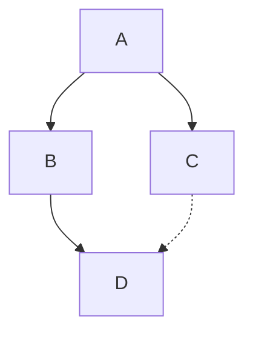

# Markdown 語法筆記教學

保哥教學影片 - [你一定不能不知道的 Markdown 寫作技巧]

## 段落、換行與標題

### 換行方式

- 方式一

中間空

一行

- 方式二

加入反斜線\
就可以分段

- 方式三

後面加入兩個空白  
但不建議使用這種方式(不易閱讀)

- 方式四
  
加入</br> 就可以分段

(這邊挑一種學習就好)

### 標題

以 # 字號來建立標題

標題一 #

標題二 ##

標題三 ###

## 清單、字型

### 無序清單

* 1
* 2
* 3

- 1
- 2
- 3

+ 1
+ 2
+ 3

(這邊挑一種學習就好)

### 有序清單

1. red
2. red
3. red

1) red
2) red
3) red

1. red
1. red
1. red

1) red
1) red
1) red

(這邊挑一種學習就好，建議第三種)

#### 額外補充

若清單下需要攥寫內容，這邊內容需要加入四個空白

1. 123

    123123

1. 123
1. 123

### 檢查清單

- [ ] check list
- [x] check list
- [x] check list

option + C 可以勾選 check list

### 清單行距

- 正常行距

1. red
2. red
3. red

- 加大行距

1. red

2. red
3. red

### 字型表示法

- 粗體 (command + B)
  
  **123**

- 斜體

  *123*

  _123_

- 刪除體

  ~~123~~

- 綜合版(自行搭配)

  ~~**123**~~

  *~~**123**~~*

## 分隔線、引言、行內程式碼

### 分隔線

分隔線一

---
分隔線二

----------------------

分隔線三

***

分隔線四

- - -

分隔線五

* * *

### 引言 (blockquote)

> 引言
>> 多層引言

### 行內程式碼

今天今天今天今天今天今天今天 `const today = 'is Good day'` 今天今天今天今天今天今天今天

## 文字區塊與程式碼區塊

    文字區塊～使用四個空白格即可
    文字區塊～使用四個空白格即可
    文字區塊～使用四個空白格即可

```ts

const block = '程式碼區塊，加入三個反引號並宣告使用的語言';

```

## 超連結與圖片

- 一般超連結 [Link Text](Link Url)
  
      Tips: 
      先打入 Link Text 再複製連結，直接反白 Link Text 貼上即可獲得超連結

    [你不能不知道的 Markdown 寫作技巧](https://www.youtube.com/watch?v=_05BEggK0IU&list=WL&index=2&t=1125s)

你不能不知道的 Markdown 寫作技巧

- 圖片超連結 

      Tips: 
      快速貼上圖片在 local 裡
      (需要下載 extension pack: Markdown Paste Image)
      Command + option + V VScode 就會問你圖片需要放在哪個 folder 裡面
      圖片後面加入 =(width)x(height) 就可以調整圖片大小

    

## 表格

- 基本表格
  
  | head1  | head2  |
  | ------ | ------ |
  | table1 | table2 |

- 對齊的儲存格

  | 靠左對齊   | 置中對齊 | 靠右對齊 |
  | ---------- | :------: | -------: |
  | 123        | 1111111  |     2222 |
  | 1111111111 |   111    |  2222222 |

      Tips:
      table 如果直接用 Markdown 編輯會較難使用
      使用 excel 最比較方便
      (需要下載 extension pack: Excel to Markdown table)
      Shift + option + V 就可以直接貼上從 excel 複製的 table
      如果排版很亂，可以使用 Shift + option + F 自動格式化

  | a   | s   | d   | f   | g   |
  | --- | --- | --- | --- | --- |
  | as  | ss  | aa  | ss  | dd  |
  | as  | ss  | aa  | ss  | dd  |
  | as  | ss  | aa  | ss  | dd  |

## 跳脫字元

若遇到跳脫字元可以使用 `\` (反斜線)跳脫

    \   反斜線
    `   反引號
    *   星號
    _   底線
    {}  大括號
    []  方括號
    ()  括號
    #   井字號
    +	加號
    -	減號
    .   英文句點
    !   驚嘆號

## TOC (Table of Content)

使用 fn + F1 找到 Markdown All in One: Create Table of Contents

就可以把整篇文章的 TOC 建立出來，若有更新標題文字因為有安裝保哥 extension 所以會自動更新

- [Markdown 語法筆記教學](#markdown-語法筆記教學)
  - [段落、換行與標題](#段落換行與標題)
    - [換行方式](#換行方式)
    - [標題](#標題)
  - [清單、字型](#清單字型)
    - [無序清單](#無序清單)
    - [有序清單](#有序清單)
      - [額外補充](#額外補充)
    - [檢查清單](#檢查清單)
    - [清單行距](#清單行距)
    - [字型表示法](#字型表示法)
  - [分隔線、引言、行內程式碼](#分隔線引言行內程式碼)
    - [分隔線](#分隔線)
    - [引言 (blockquote)](#引言-blockquote)
    - [行內程式碼](#行內程式碼)
  - [文字區塊與程式碼區塊](#文字區塊與程式碼區塊)
  - [超連結與圖片](#超連結與圖片)
  - [表格](#表格)
  - [跳脫字元](#跳脫字元)
  - [TOC (Table of Content)](#toc-table-of-content)
  - [Mermaid diagrams](#mermaid-diagrams)


## Mermaid diagrams

畫流程方便好用，有需要可以去看[Mermaid 官方文件]



<!-- links 管理的地方 -->
[你一定不能不知道的 Markdown 寫作技巧]: https://www.youtube.com/watch?v=_05BEggK0IU

[Mermaid 官方文件]: https://mermaid.js.org/intro/

