# Grid Template

教學影片：[CSS Grid Course]

## First Grid

先來個簡單的 Grid

```html
<div class="container">
  <div>1</div>
  <div>2</div>
  <div>3</div>
  <div>4</div>
  <div>5</div>
  <div>6</div>
  <div>7</div>
  <div>8</div>
</div>
```

先在父層display: grid 將子層的元素變成 grid

grid-template-columns, grid-template-rows 代表你要切多少格線，現在這個寫法是切成 3x3

columns(橫向)：左右各 100px，中間為 auto

rows(直向)：每行各 100px

```scss
.container {
  display: grid;
  grid-template-columns: 100px auto 100px;
  grid-template-rows: 100px 100px 100px;
}
```
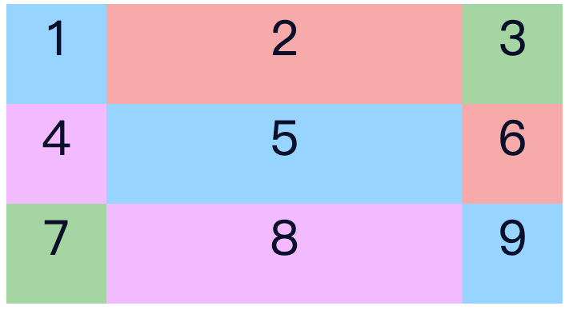

還有其他可以變化的地方，可把寬度改成 fr 的單位

比如說 grid-template-columns: 1fr 1fr 1fr; 代表將容器的寬度平均分成三份

每一個 column 得到一份

```scss
.container {
  display: grid;
  grid-template-columns: 1fr 1fr 1fr;
  // grid-template-columns: repeat(3, 1fr); 也可以寫成這樣，代表重複 3 次 1 fr
  grid-template-rows: 100px 100px 200px;
  // grid-template-rows: repeat(3, 100px)
  grid-gap: 3px; // 每個格線中間的間距
}
```

也可以把 columns, rows 寫在一起

grid-template: rows / columns;

```scss
.container {
  display: grid;
  grid-template: repeat(2, 100px) / repeat(6, 1fr);
  grid-gap: 3px;
}
```


## Layout Grid

先使用簡單的 layout 當作範例，比如該 layout 包括header, menu, content, footer

```html
<div class="container">
  <div class="header">HEADER</div>
  <div class="menu">MENU</div>
  <div class="content">CONTENT</div>
  <div class="footer">FOOTER</div>
</div>
```
```scss
.container {
  display: grid;
  grid-gap: 3px;
  // grid-template: 50px 200px 50px / repeat(2, 1fr);
  grid-template: 50px 200px 50px / repeat(12, 1fr);
}

.header {
  // 數字代表 column line
  grid-column-start: 1;
  grid-column-end: -1;
  // grid-column: 1 / 3
}

.menu {
  // 未給 column 數值代表寬度與內容一樣
}

.content {
  grid-column: 2 / -1;
}

.footer {
  // 1
  // grid-column-start: 1;
  // grid-column-end: 3;
  // 2
  // grid-column: 1 / 3;
  // 3 從第一條開始佔兩格
  // grid-column: 1 / span 2;
  // 4, -1 代表倒數第一個
  grid-column: 1 / -1;
}

```
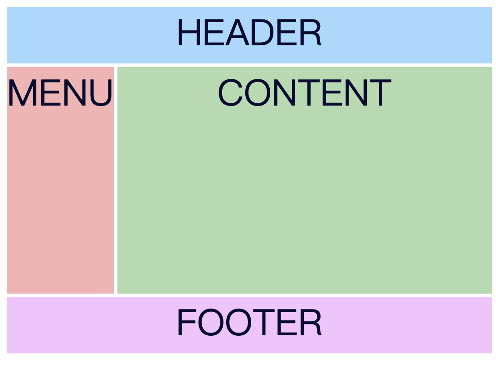

再將 scss 改一下就可以變成不同的 layout

```scss
.container {
  display: grid;
  grid-gap: 3px;
  grid-template: 50px 200px 50px / repeat(12, 1fr);
}

.header {
  grid-column: 2 / -1
}

.menu {
  grid-row: 1 / 3;
}

.content {
  grid-column: 2 / -1;
}

.footer {
  grid-column: 1 / -1;
}

```
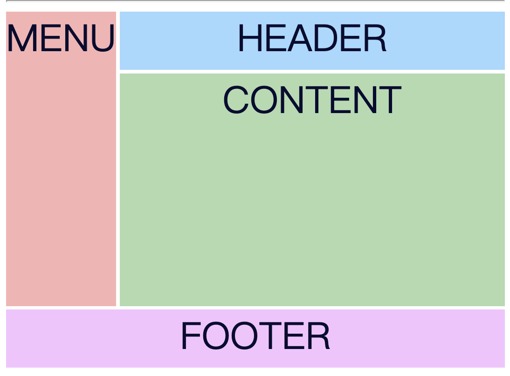

## Grid area

使用 Grid area 來排 layout，先賜予不同 class grid-area 名字

然後再使用 grid-template-areas 當成畫布來畫圖

看起來非常直覺，想要改改 layout 也很快

+ 但如果 column, row 太多會寫太多(範例為 12 欄)

```html
<div class="container">
  <div class="header">HEADER</div>
  <div class="menu">MENU</div>
  <div class="content">CONTENT</div>
  <div class="footer">FOOTER</div>
</div>
```

```scss
.container {
  height: 300px;
  display: grid;
  grid-gap: 3px;
  grid-template-columns: repeat(12, 1fr);
  grid-template-rows: 40px auto 40px;
  grid-template-areas:
    'h h h h h h h h h h h h'
    'm c c c c c c c c c c c'
    'f f f f f f f f f f f f';
}

.header {
  grid-area: h;
}

.menu {
  grid-area: m;
}

.content {
  grid-area: c;
}

.footer {
  grid-area: f;
}

```
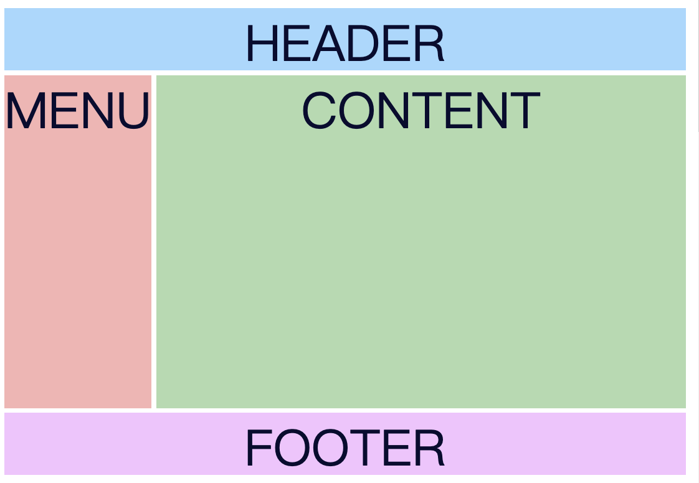

```scss
.container {
  height: 300px;
  display: grid;
  grid-gap: 3px;
  grid-template-columns: repeat(12, 1fr);
  grid-template-rows: 40px auto 40px;
  grid-template-areas:
    'm h h h h h h h h h h h'
    'm c c c c c c c c c c c'
    'f f f f f f f f f f f f';
}
```

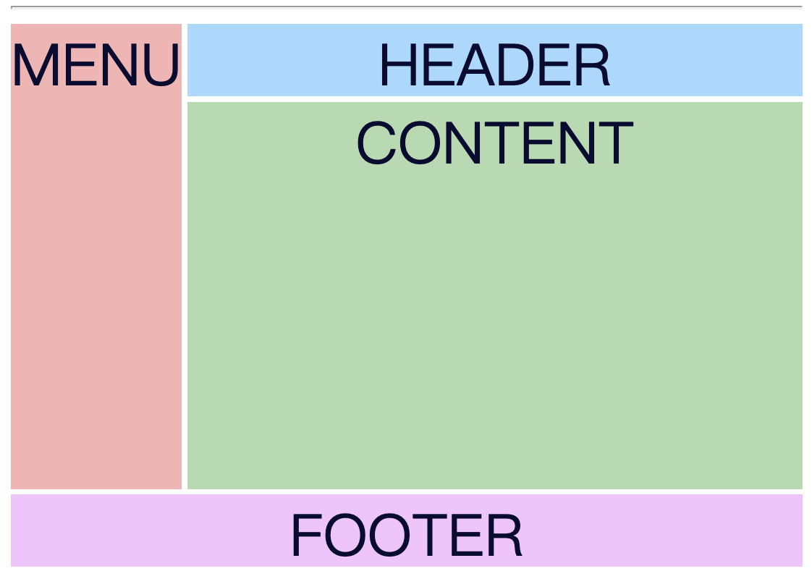

當你格子內不想填入任何東西時就可以使用 '.' 來代替，但使用時需注意要連續且不能 ㄈ 或 Ｌ 字的方式，會壞掉

```scss
.container {
  height: 300px;
  display: grid;
  grid-gap: 3px;
  grid-template-columns: repeat(12, 1fr);
  grid-template-rows: 40px auto 40px;
  grid-template-areas:
    '. h h h h h h h h h h .'
    'm c c c c c c c c c c c'
    '. f f f f f f f f f f f';
}
```

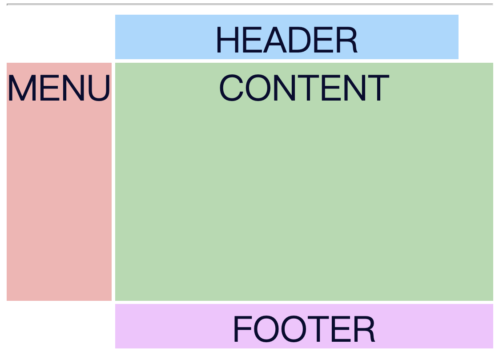

## Auto-Fit and MinMax

先給一個基本的樣式

```html
<div class="container">
  <div>1</div>
  <div>2</div>
  <div>3</div>
  <div>4</div>
  <div>5</div>
  <div>6</div>
  <div>7</div>
  <div>8</div>
  <div>9</div>
  <div>10</div>
  <div>11</div>
  <div>12</div>
</div>
```

```scss
.container {
  display: grid;
  grid-gap: 3px;
  // 固定大小
  //grid-template-columns: repeat(6, 50px);
  // columns 依據容器寬度做伸縮，但如果容器過大或過小會導致格線過大或過小
  grid-template-columns: repeat(6, 1fr);
  grid-template-rows: repeat(2, 50px);
}
```
### 固定 50px

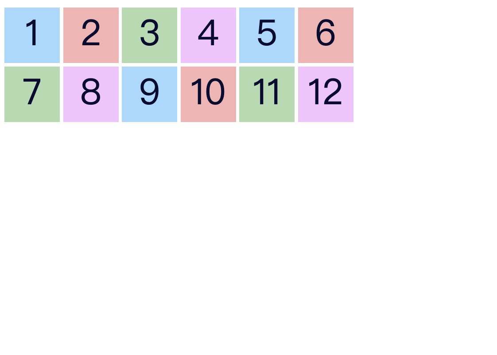

### 寬度為 1fr 會依據容器寬度伸縮

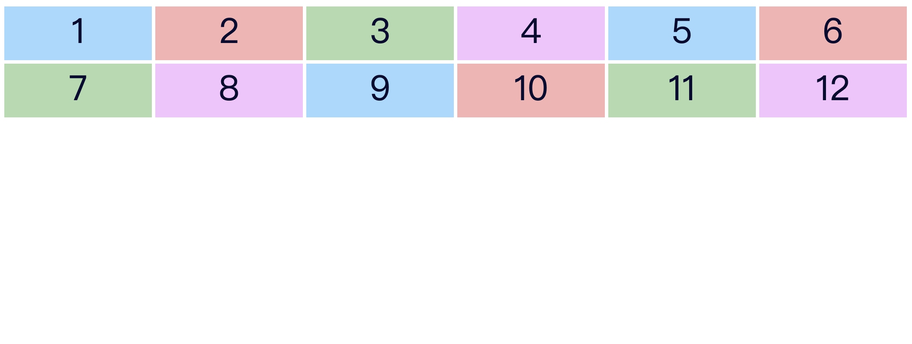

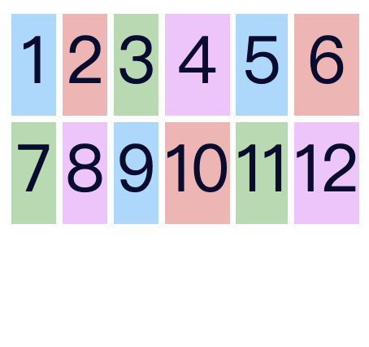

若將 columns 6 改成 auto-fit，當第一排空間大於 50px 時第二排的 div 會補到第一排，若空間過小則會往第三排與第四排往下推

```scss
.container {
  display: grid;
  grid-gap: 3px;
  grid-template-columns: repeat(auto-fit, 50px);
  grid-template-rows: repeat(2, 50px);
}
```
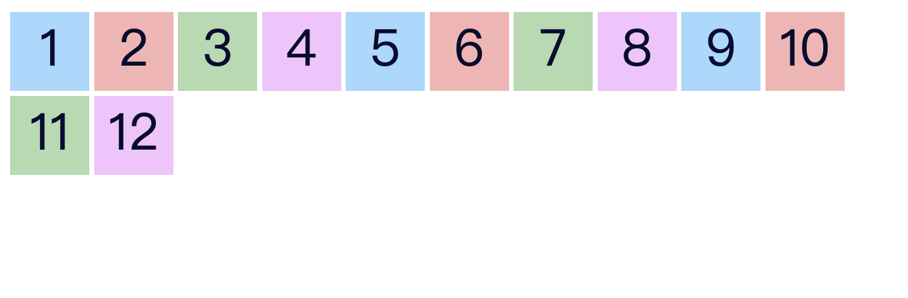
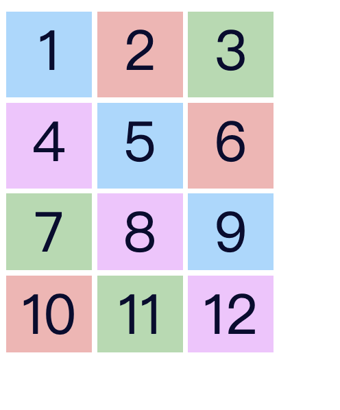

但這邊又有個問題就是當不滿 50px 右邊會留白

將 columns 寬度改成 minmax(50px, 1fr) 這邊代表最小為 50px 

當右邊的寬度小於 50px 時則會使用 1fr 的形式填滿該欄

當大於 50px 時第二排的格子就會往上推，就可以避免留白問題。

這樣就可以解決 web 過寬或 phone 過窄的問題

```scss
.container {
  display: grid;
  grid-gap: 3px;
  grid-template-columns: repeat(auto-fit, minmax(50px, 1fr));
  grid-template-rows: repeat(2, 50px);
}
```

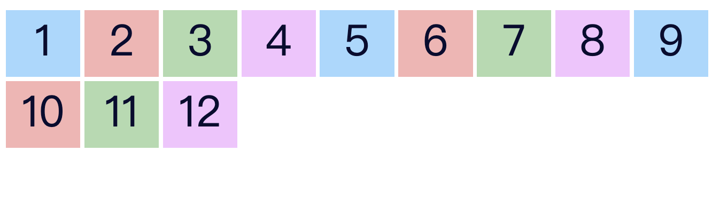

### implicit rows

在這邊 row 只固定兩排，當跑到第三排時高度不會是 50px，高度會等於內容的寬度，這邊就要改寫 row scss

```scss
.container {
  display: grid;
  grid-gap: 3px;
  grid-template-columns: repeat(auto-fit, minmax(50px, 1fr));
  grid-auto-rows: 50px;
}
```

### images grid

先建立基本形式

```html
<div class="container">
  
</div>

```

```ts
images = [
    1, 2, 3, 4, 5, 6, 7, 8, 9, 10, 11, 12, 13, 14, 15, 16, 17, 18, 19, 20,
  ];
```

```scss
img {
  width: 100%;
  height: 100%;
  object-fit: cover;
}

.container {
  display: grid;
  grid-gap: 3px;
  grid-template-columns: repeat(auto-fit, minmax(100px, 1fr));
  grid-auto-rows: 75px;
}
```


現在想做一個相片牆，每格一些照片就有大小不一照片

```scss
img {
  width: 100%;
  height: 100%;
  object-fit: cover;
}

.container {
  display: grid;
  grid-gap: 3px;
  grid-template-columns: repeat(auto-fit, minmax(100px, 1fr));
  grid-auto-rows: 75px;
}

.container > img:nth-child(5n+5) {
  // 讓圖片從第一條線開始佔兩格，但右邊就會是空的
  // grid-column: 1 / span 2;
  // 把它改成 auto 就會自己排列
  grid-column: auto / span 2;
  // 也可以寫成這樣
  // grid-column: span 2;
}
```
### grid-column: 1 / span 2

### grid-column: auto / span 2


```scss
img {
  width: 100%;
  height: 100%;
  object-fit: cover;
}

.container {
  background-color: lightcoral;
  display: grid;
  grid-gap: 3px;
  grid-template-columns: repeat(auto-fit, minmax(100px, 1fr));
  grid-auto-rows: 75px;
}

.container > img:nth-child(7n + 5) {
  grid-column: auto / span 2;
  // grid-column: span 2;
}

.container > img:nth-child(7n + 3) {
  grid-row: span 2;
}

.container > img:nth-child(7n + 2) {
  grid-row: span 2;
  grid-column: span 2;
}
```
當隨意調整排列時，第二列第二格沒辦法填滿（col=2）所以會空白並折行


若想要後面的補齊則加入 grid-auto-flow: dense;
```scss
.container {
  background-color: lightcoral;
  display: grid;
  grid-gap: 3px;
  grid-template-columns: repeat(auto-fit, minmax(100px, 1fr));
  grid-auto-rows: 75px;
  // default => row
  // dense => 當有空的時小的格線會填滿
  grid-auto-flow: dense;
}
```


## Named Lines

將 grid 命名後使用名稱來限制 grid 範圍

先建立基本樣式
```html
<div class="container">
  <div class="header">HEADER</div>
  <div class="menu">MENU</div>
  <div class="content">CONTENT</div>
  <div class="footer">FOOTER</div>
</div>
```

```scss
.container {
  display: grid;
  grid-gap: 3px;
  grid-template-columns: 1fr 5fr ;
  grid-template-rows: 50px 200px 50px;
}

.header {
  grid-column: 1 / 3;
}

.menu {
  grid-row: 2 / 3;
}

.content {
  grid-column: 2 / 3;
}

.footer {
  grid-column: 1 / 3;
}
```
layout 就會像下圖


接下來修改下 scss

```scss
.container {
  display: grid;
  grid-gap: 3px;
  // grid-template-columns: 1fr 5fr ;
  // 這邊加入 start, end 名稱
  grid-template-columns: [main-start] 1fr [content-start] 5fr [content-end main-end];
  grid-template-rows: 50px 200px 50px;
}

.header {
  grid-column: main-start / main-end;
  // column 也可以寫成這樣
  // grid-column: main / main;
  // grid-column: 1 / 3;
}

.menu {
  grid-row: 2 / 3;
}

.content {
  grid-column: content-start / content-end;
}

.footer {
  grid-column: main-start / main-end;
  // grid-column: 1 / 3;
}
```
加入名稱後就可以使用名稱還定義格線位置


接下來加入 rows
```scss
.container {
  display: grid;
  grid-gap: 3px;
  // grid-template-columns: 1fr 5fr ;
  // 這邊加入 start, end 名稱
  grid-template-columns: [main-start] 1fr [content-start] 5fr [content-end main-end];
  // grid-template-rows: 50px 200px 50px;
  // -- 1 : 加入 row and column 後可使用 grid-area
  grid-template-rows: [main-start] 50px [content-start] 200px [content-end] 50px [main-end];
}

.header {
  grid-column: main;
  // grid-column: 1 / 3;
}

.menu {
  grid-row: 2 / 3;
}

.content {
  // grid-column: 2 / 3;
  // -- 1 : 這邊就使用名字定義了 gird 範圍後就可以使用 grid area
  grid-area: content;
}

.footer {
  grid-column: main-start / main-end;
  // grid-column: 1 / 3;
}
```

修改完後會發現 layout 一樣沒有改變


## Grid align

Grid 也可以使用 justify-content, align-content, justify-items, align-items 排列(跟 flex 一樣)


先建立基本樣式
```html
<div class="container">
  <div>1</div>
  <div>2</div>
  <div>3</div>
  <div>4</div>
  <div>5</div>
  <div>6</div>
</div>
```
```scss
.container {
  border: 1px solid black;
  height: 400px;
  display: grid;
  grid-template-columns: repeat(3, 100px);
  grid-template-rows: repeat(2, 100px);
  grid-gap: 3px;
}
```
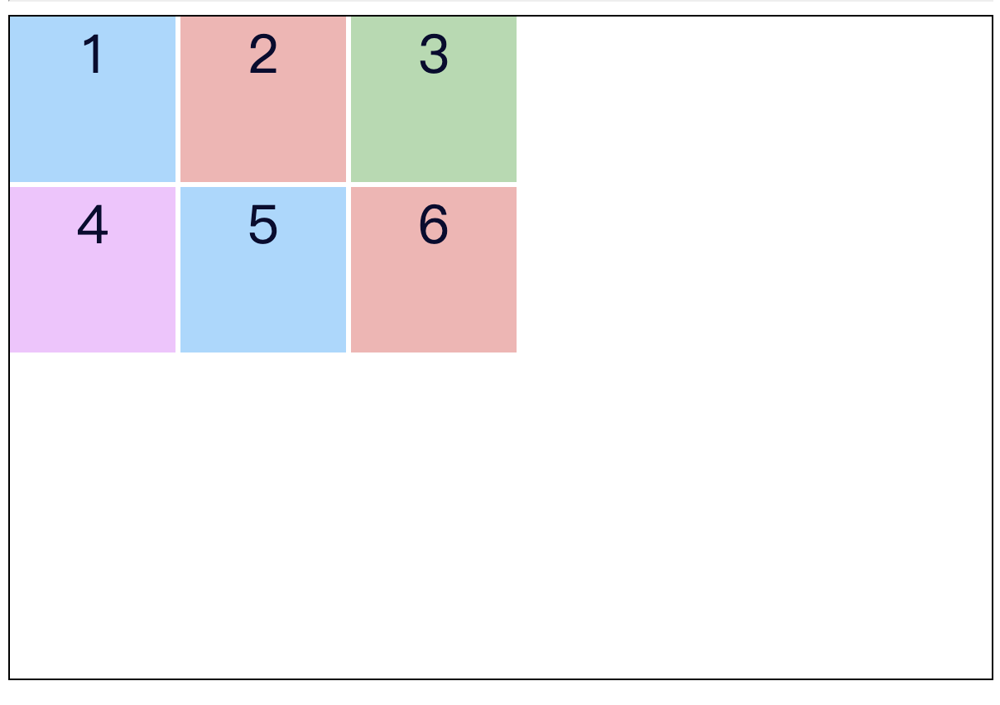

### justify-content and align-content

加入 justify-content, align-content 後就可以隨意排列整個 container
```scss
.container {
  border: 1px solid black;
  height: 400px;
  display: grid;
  grid-template-columns: repeat(3, 100px);
  grid-template-rows: repeat(2, 100px);
  grid-gap: 3px;
  // justify-content: center / start / end / space-between...;
  justify-content: center;
  // align-content: center / start / end
  align-content: end;
}
```

### justify-items, align-items, justify-self, align-self

略～～ 自己 try try

justify-items, align-items >> 下在父層

justify-self, align-self >> 下在子層

## Auto-Fill and Auto-Fit

兩者有些微差異，直接看程式碼

```html
<h1>Auto-Fit</h1>
<div class="container auto-fit">
  <div>1</div>
  <div>2</div>
  <div>3</div>
  <div>4</div>
</div>

<h1>Auto-Fill</h1>
<div class="container auto-fill">
  <div>1</div>
  <div>2</div>
  <div>3</div>
  <div>4</div>
</div>

```
```scss
.container {
  border: 1px solid black;
  display: grid;
  grid-gap: 3px;
}

.auto-fit {
  grid-template-columns: repeat(auto-fit, minmax(100px, 1fr));
  grid-template-rows: repeat(2, 100px);
}

.auto-fill {
  grid-template-columns: repeat(auto-fill, minmax(100px, 1fr));
  grid-template-rows: repeat(2, 100px);
}

```

兩者有些微差異就是當寬度大於 container 時，auto-fill 後面會加入空的格線，所以不會伸縮過大

相較於 auto-fit 他則會自適應整個容器，故當容易過大時他就會過大

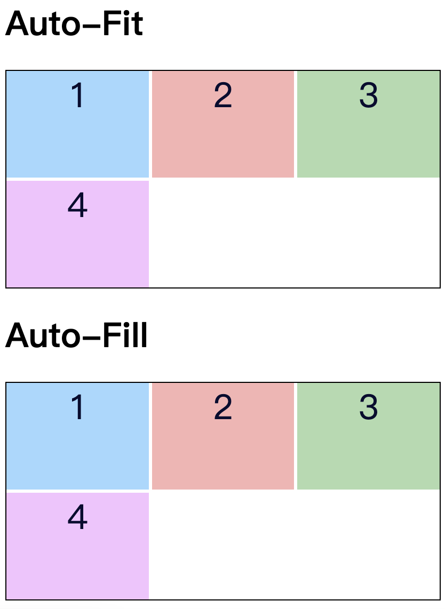
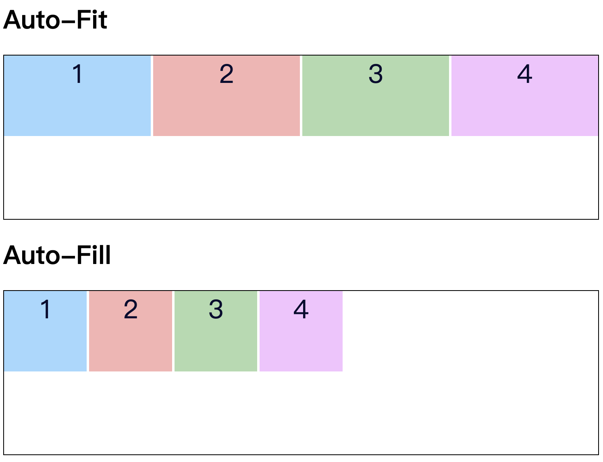

課程 ＥＮＤ！！！！ 耶耶耶！！！！

接下來看一些 grid 應用吧


其他資料

[CSS Grid | 剛學會怎麼用 Grid，那就來畫個 TV 檢驗圖練練手吧！]

[畫個飛利浦 PM5544 檢驗圖]


[CSS Grid Course]: https://www.youtube.com/watch?v=t6CBKf8K_Ac&t=2185s

[CSS Grid | 剛學會怎麼用 Grid，那就來畫個 TV 檢驗圖練練手吧！]: https://medium.com/%E6%89%8B%E5%AF%AB%E7%AD%86%E8%A8%98/using-css-grid-to-draw-test-card-7ed24d3559ab

[畫個飛利浦 PM5544 檢驗圖]: https://codepen.io/Airwavess/pen/QWjLQJZ
